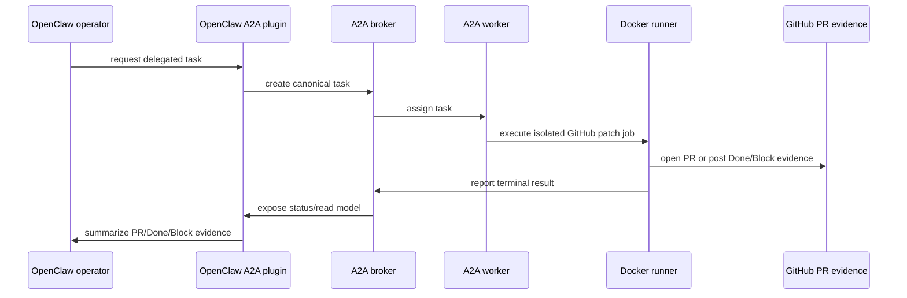

# Canonical A2A Demo

This demo is a public-safe, no-live-send reference flow for the private A2A monorepo candidate.

## No-live safety boundary

The demo must not perform production deploys, Gateway restarts, production database mutations, live provider/Telegram sends, terminal-outbox ACK mutation, secret rotation, secret disclosure, history rewrite, force push, or repository visibility changes.

## Sample task

See [`examples/canonical-demo-task.json`](../examples/canonical-demo-task.json). The example uses placeholders only. Replace placeholders in a private environment before running any real task.

## Expected terminal evidence

A successful patch-producing task should end with one of:

- `PR`: pull request URL, changed files summary, focused check output, and safety statement.
- `Done`: no PR required, with redacted evidence and check output.
- `Block`: blocker category, safe redacted metadata, and exact next action.

Provider-send acceptance is not operator-visible receipt or terminal ACK evidence.
