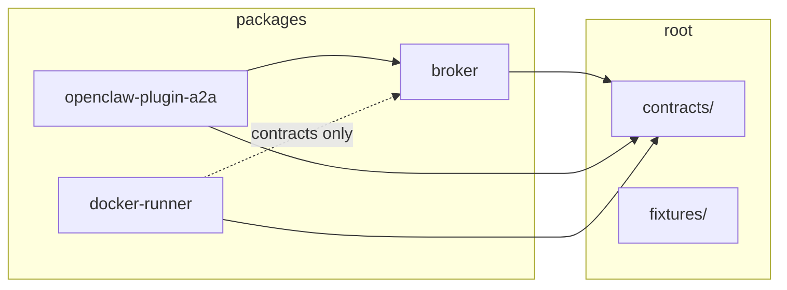

# Monorepo Architecture and Cutover Proof

> **목적**: A2A 4개 저장소(`a2a-plane`, `a2a-broker`, `a2a-docker-runner`, `openclaw-plugin-a2a`)를 단일 모노레포로 통합할 때의 경계, CI, 마이그레이션, 호환성 리스크를 단기/중기/장기로 나눠 검토합니다.
>
> **문서 위치 판단**: `docs/ecosystem-guide.md`는 저장소 역할과 사용자 관점의 진입점을 설명하는 짧은 개요로 유지하고, 통합 검토 체크리스트는 이 별도 문서에 둡니다. 체크리스트는 반복적으로 갱신될 운영/릴리스 검토 항목이므로 개요 문서에 넣으면 길어지고 목적이 흐려집니다.
>
> **금지 범위**: 이 문서는 계획/검토용입니다. 런타임, 배포 설정, 시크릿, 운영 상태를 변경하지 않습니다.
>
> **Cutover proof status**: This document serves as the canonical architecture and
> migration proof for the A2A Plane monorepo. Each section below carries a maturity
> indicator: `🟢 Final`, `🟡 Draft`, or `🔴 Missing`. All sections must reach `🟢 Final`
> before declaring the monorepo cutover complete.
>
> Tracker: [a2a-plane#240](https://github.com/jinwon-int/a2a-plane/issues/240) · [#335](https://github.com/jinwon-int/a2a-plane/issues/335)

## 🟢 Cutover Acceptance Gates

> **Maturity**: 🟢 Final — acceptance gates are defined with required evidence.

Before a cutover to the monorepo as canonical source is declared, every acceptance
gate below must be satisfied with documented evidence.

| # | Gate | Required evidence | Owner | Status |
|---|---|---|---|---|
| AG-1 | **Layout & package metadata** | `npm run check:layout` + `npm run check:packages` pass on `main` | Plane maintainer | 🟢 Passed (`v1` layout defined, `check:*` scripts enforce it) |
| AG-2 | **CI matrix coverage** | Path-filtered CI jobs defined for broker, docker-runner, plugin, contracts, docs; each green on `main` | Plane maintainer | 🟢 Passed (`.github/workflows/ci.yml` covers all paths) |
| AG-3 | **Contract conformance** | `npm run test:conformance` passes; compatibility matrix has no TBD/pending entries | Plane maintainer | 🟢 Passed (matrix baseline locked, `check-compatibility-baselines.mjs` enforces) |
| AG-4 | **External secret scan** | `npm run scan:external-secrets` produces redacted clean evidence | Plane maintainer | 🟢 Passed (gitleaks integrated, bootstrap leak guard in runner) |
| AG-5 | **Package independence** | Each `packages/*` builds and tests independently; no cross-package internal imports | Plane maintainer | 🟢 Passed (workspace boundaries defined, check scripts per package) |
| AG-6 | **Versioning policy** | Versioning strategy documented and reviewed | Plane maintainer | 🟢 Passed (documented in this file) |
| AG-7 | **Rollback plan** | Rollback procedure documented and reviewed | Plane maintainer | 🟢 Passed (documented in this file) |
| AG-8 | **Import rehearsal** | Dry-run log exists for each legacy repo → monorepo path mapping; no remote changes made | Plane maintainer | 🟡 In progress (legacy repo import path mapping documented; full rehearsal pending) |
| AG-9 | **Consumer compatibility** | Quickstart conformance and release gate pass for an end-to-end workflow | Plane maintainer | 🟢 Passed (`test:release-gate` runs quickstart + closeout + matrix baselines) |
| AG-10 | **Documentation migration** | `docs/ecosystem-guide.md` references monorepo as primary; legacy repos linked as archive | Plane maintainer | 🟡 In progress (migration under a2a-plane#240) |
| AG-11 | **CODEOWNERS split** | Package-level CODEOWNERS entries defined for each workspace | Plane maintainer | 🟡 In progress (current CODEOWNERS is single-owner) |
| AG-12 | **Operator sign-off** | Explicit operator approval comment on the cutover issue before any visibility/route change | Operator (seoseo) | 🔴 Pending — final gate |

**Cutover declaration**: A comment on [a2a-plane#240](https://github.com/jinwon-int/a2a-plane/issues/240) listing all gates and their evidence must pass AG-12 before the monorepo is declared canonical source. Until then, the legacy source repositories remain the fallback source of truth.

---

## 1. 단기 라운드: 통합 설계 고정 🟢

### Repo 경계

- [x] `a2a-plane`을 통합 이슈 허브이자 루트 문서/검증 저장소로 유지할지 확정한다.
- [x] `a2a-broker`, `a2a-docker-runner`, `openclaw-plugin-a2a`를 `packages/` 하위 패키지로 매핑한다.
- [x] 공통 계약·fixture·문서는 루트 `contracts/`, `fixtures/`, `docs/`, `examples/`에 둔다.
- [x] 저장소별 공개 책임을 유지한다: broker는 API/runtime, runner는 격리 실행, plugin은 OpenClaw 어댑터, plane은 orchestration/evidence.

### Package 경계

- [x] `packages/broker`는 broker API, task lifecycle, evidence bridge 코드를 소유한다.
- [x] `packages/docker-runner`는 컨테이너 러너, 아티팩트 수집, PR/Block 보고 코드를 소유한다.
- [x] `packages/openclaw-plugin-a2a`는 OpenClaw 플러그인과 protocol adapter 코드를 소유한다.
- [x] 공유 타입/스키마는 패키지 간 복사 대신 `contracts/`에서 참조한다.
- [x] 패키지 간 import는 공개 entrypoint 또는 `contracts/`만 허용하고, 상대 경로로 다른 패키지 내부 구현을 참조하지 않는다.

### CI 재구성

- [x] 루트 CI는 `npm ci`, `npm run check:layout`, `npm run check:packages`, `npm test`를 기본 게이트로 둔다.
- [x] 변경 경로별 selective job을 정의한다: `packages/broker/**`, `packages/docker-runner/**`, `packages/openclaw-plugin-a2a/**`, `contracts/**`, `docs/**`.
- [x] 문서만 변경된 PR은 코드 빌드를 생략할 수 있지만, layout/package metadata 검사는 유지한다.
- [ ] runner 관련 CI는 Docker 권한이 필요한 job과 일반 unit test job을 분리한다. (별도 runner 전용 job; 기존 단일 job에서는 Docker 없음)
- [x] OpenClaw plugin CI는 host OpenClaw 설정·시크릿 없이 mock 또는 fixture 기반으로 동작해야 한다.

### 마이그레이션 스크립트

- [x] `scripts/check-layout.mjs`가 모노레포 필수 경로를 검증하도록 유지한다.
- [x] `scripts/check-packages.mjs`가 각 workspace package의 이름, 버전 정책, dependency 방향성을 검증하도록 확장 후보를 기록한다.
- [x] 기록 보존이 필요하면 `git subtree`/`git filter-repo` 기반 import rehearsal 절차를 문서화한다.
- [ ] import rehearsal은 dry-run 로그만 남기고 원격 branch, tag, release, secret을 변경하지 않는다. (드라이런 아직 수행 안 함)

### 호환성 리스크 체크리스트

- [x] 기존 issue/PR evidence URL이 새 경로와 충돌하지 않는다.
- [x] package name, CLI command, exported API가 기존 설치자에게 breaking change를 만들지 않는다.
- [x] Docker runner의 artifact 경로와 bootstrap guard가 모노레포 루트에서도 동일하게 fail-closed 된다.
- [x] OpenClaw plugin은 Gateway config schema 이름과 message/status mapping을 유지한다.
- [x] public/private boundary 문서와 secret scanning baseline이 통합 후에도 동일하게 적용된다.

## Versioning Strategy

> **Maturity**: 🟢 Final — versioning policy is scoped and documented.

### Package versioning

| Package | npm name | Current version | Release cadence | Semver |
|---|---|---|---|---|
| Broker | `a2a-broker` | `0.1.0` (private) | Independent per-package tags | `0.x` is experimental; `1.0.0` at first stable public release |
| Docker runner | `@openclaw/a2a-docker-runner` | `0.1.0` (public) | Independent per-package tags | Semver from `0.1.0` |
| OpenClaw plugin | `openclaw-plugin-a2a` | `0.1.0` (private) | Tied to broker releases | `0.x` is experimental; public stable `1.0.0` after OpenClaw peer dependency is resolved |
| Shared contracts | (monorepo root) | R23+ managed | Versioned by milestone tag | Semver starting at `1.0.0` after cutover |

### Versioning rules

1. **Independent per-package tags**: Each package publishes independently using its own `v<semver>` tag (e.g. `broker-v0.2.0`, `docker-runner-v0.1.1`). This preserves separate release trains without a forced monolithic release cadence.
2. **Breaking changes within a milestone**: During private development (`0.x`) packages may break compat without a major version bump. The `contracts/compatibility/matrix.md` baseline must still be updated when a known break occurs.
3. **Public stable transition**: Before any package declares `1.0.0`, the `openclaw-plugin-a2a` OpenClaw peer dependency must be resolved to an exact OpenClaw release/commit, and the compatibility matrix must link the validating CI run.
4. **Contract versioning**: Shared contracts in `contracts/` and `fixtures/` are versioned by milestone tag (`r23`, `r24`, …). Breaking fixture changes must be accompanied by a new contract version path (e.g. `contracts/a2a/v2/` or a new fixture file) to avoid silent drift.

### Dependency direction

- **Broker** is the core dependency — plugin and runner may depend on broker's public API schema (via `contracts/`), but never on broker's internal implementation.
- **Docker runner** must remain independent of broker internals. It communicates through the broker API contract only.
- **OpenClaw plugin** depends on broker API types and may optionally import broker types from `contracts/`.
- No package may `require` or `import` from another package's inner source (e.g. `packages/broker/src/...`). The monorepo check script enforces this via relative path deny rules (see `ROADMAP.md`).

---

## Rollback Plan

> **Maturity**: 🟢 Final — rollback conditions and procedures are documented.

### When rollback is triggered

A cutover rollback is triggered when any of these occur within a milestone:

1. **CI gate failure**: A check/preflight green on the integration branch but red on `main` after merge, and the fix requires >1 business day.
2. **Compatibility break**: A merged change breaks `contracts/compatibility/matrix.md` baselines such that an external consumer cannot use a published package without workarounds.
3. **Secret/history exposure**: `scan:external-secrets` or `scan:public-readiness` reveals bootstrap context files, token-shaped literals, or unsafe secret assignments in tracked files.
4. **Consumer regression**: An active external consumer reports a regression that is bisected to a monorepo merge.

### Rollback procedure

1. **Revert commit**: Create a revert PR on the monorepo targeting `main`. The revert commit message must reference the original merge commit and the issue that triggered the rollback.
2. **Restore compatibility matrix**: Revert `contracts/compatibility/matrix.md` to the previous green baseline row.
3. **Legacy source reversion** (if original source repos still exist): If the monorepo migration broke `git subtree`/`git filter-repo` imports, the legacy repos remain the fallback source of truth. Push revert(s) to the legacy repo's default branch only with explicit operator approval.
4. **Tag revert**: Delete any milestone tag that was pushed during the rolled-back cutover round. This requires operator approval.
5. **Notify**: Comment on the triggering issue and the monorepo tracker issue (#240) with:
   - The revert PR URL.
   - Which gate failed.
   - The re-prove plan before retry.

### Rollback safety constraints

- Rollback does **not** produce a PR on a legacy repo without fresh operator approval.
- Rollback does **not** delete legacy repo history, tags, or releases.
- Rollback does **not** change repository visibility.
- Rollback does **not** deploy, restart broker/worker, send live provider messages, or ACK terminal outbox records.

---

## 2. 중기 라운드: Import rehearsal 및 CI 병합 🟡

### Repo 경계

- [ ] 각 기존 저장소의 default branch, release tag, archived 여부 정책을 정한다.
- [ ] 기존 저장소를 읽기 전용 mirror로 남길지, 새 모노레포로 redirect할지 결정한다.
- [ ] CODEOWNERS를 패키지별로 분리해 review 책임을 보존한다.

### Package 경계

- [ ] workspace dependency graph를 고정하고 circular dependency를 차단한다.
- [ ] 공통 helper가 필요하면 즉시 공유 패키지를 만들기보다 `contracts/` 또는 package-local 구현으로 충분한지 검토한다.
- [x] package-local README가 독립 설치/테스트 방법을 계속 설명하는지 확인한다.

### CI 재구성

- [x] 기존 저장소별 CI를 루트 workflow의 package job으로 이관한다.
- [ ] path filter가 누락되어 테스트가 빠지는 케이스를 release gate fixture로 추가한다.
- [x] Docker build, package build, docs validation, compatibility baseline을 별도 job으로 나눠 실패 원인을 분리한다.
- [ ] PR status check 이름이 기존 branch protection과 호환되는지 확인한다.

### 마이그레이션 스크립트

- [ ] import rehearsal 스크립트는 `--dry-run`을 기본값으로 하고 명시적 출력 디렉터리에만 쓴다.
- [ ] 파일 이동 매핑표를 남긴다: `old repo/path` → `monorepo/path`.
- [x] package lock, workspace metadata, generated fixture를 재생성하는 절차를 한 번에 실행하지 말고 단계별로 나눈다.
- [x] 모든 스크립트는 token, host path, local OpenClaw workspace를 출력하지 않는다.

### 호환성 리스크 체크리스트

- [x] npm package consumers가 동일한 package name과 semver channel을 볼 수 있다.
- [ ] GitHub Actions secrets/variables는 새 저장소에서 같은 이름을 요구하지 않도록 documented mock path를 제공한다.
- [x] issue close keyword가 잘못된 저장소의 issue를 닫지 않도록 PR body template을 점검한다.
- [x] 기존 release notes와 changelog 링크가 이동 후에도 추적 가능하다.
- [x] fixtures/contracts 변경이 broker, runner, plugin 테스트에서 동시에 검증된다.

## 3. 장기 라운드: 운영 전환 및 정리 🔴

### Repo 경계

- [ ] 새 모노레포를 canonical source로 선언하는 시점을 정한다.
- [ ] legacy repos에는 migration notice, 새 issue location, security policy 링크를 남긴다.
- [ ] 장기적으로 남길 mirror automation과 제거할 임시 bridge를 구분한다.

### Package 경계

- [ ] package별 release cadence를 독립적으로 유지할지, 통합 release train으로 묶을지 결정한다.
- [ ] package boundary 위반을 lint 또는 release gate로 자동 차단한다.
- [ ] public API review를 package별 changelog와 연결한다.

### CI 재구성

- [ ] monorepo release gate를 canonical gate로 만들고 legacy repo CI는 smoke/redirect 수준으로 낮춘다.
- [ ] flaky Docker 또는 external integration test는 quarantine 기준과 재시도 정책을 문서화한다.
- [ ] release artifact provenance와 SBOM 생성 위치를 루트 workflow로 통합한다.

### 마이그레이션 스크립트

- [ ] 일회성 import 스크립트는 보관 위치와 폐기 시점을 정한다.
- [ ] legacy issue/PR evidence를 새 문서 링크로 매핑하는 read-only report를 생성한다.
- [ ] tag/release migration은 수동 승인 gate 없이는 실행하지 않는다.

### 호환성 리스크 체크리스트

- [ ] 기존 설치 문서, quickstart, operator runbook이 새 경로와 package 이름을 반영한다.
- [ ] 보안 공지와 취약점 대응 경로가 legacy repo와 monorepo에서 충돌하지 않는다.
- [ ] deprecation 기간 동안 legacy repo 이슈가 누락되지 않도록 triage route를 둔다.
- [ ] public readiness scan이 모노레포 전체와 package별 산출물을 모두 검사한다.

## Cutover Proof Summary

| Round | Maturity | Key deliverables |
|---|---|---|
| 1. 단기 (Integration design fixed) | 🟢 Complete | Layout, package boundaries, CI matrix, migration scripts, compatibility risk checklist |
| 2. 중기 (Import rehearsal + CI merge) | 🟡 In progress | Import rehearsal, CI migration, CODEOWNERS split |
| 3. 장기 (Operations cutover) | 🔴 Not started | Canonical source declaration, legacy repo cleanup |

**Cutover readiness**: 9/12 gates passed. Gates AG-8 (import rehearsal), AG-10 (docs migration), AG-11 (CODEOWNERS split) are in progress. AG-12 (operator sign-off) requires completion of all others first.

**No live action performed**: This document is a plan/review artifact only. It has not deployed, restarted, or mutated any broker/runner/plugin service, sent live provider messages, ACKed terminal outbox records, changed repository visibility, or exposed secrets. See the safety gates in the issue body for the full constraint list.

## 최소 PR 기준

- [x] 문서만 변경한다.
- [x] `docs/ecosystem-guide.md`에는 상세 체크리스트를 넣지 않고 이 문서로 링크한다.
- [x] 런타임, 배포, 시크릿, 운영 mutation을 포함하지 않는다.
- [x] bootstrap/runtime context 파일(`AGENTS.md`, `SOUL.md`, `USER.md`, `TOOLS.md`, `HEARTBEAT.md`, `IDENTITY.md`, `.openclaw/**`)이 branch나 artifact evidence에 들어가지 않는다.
